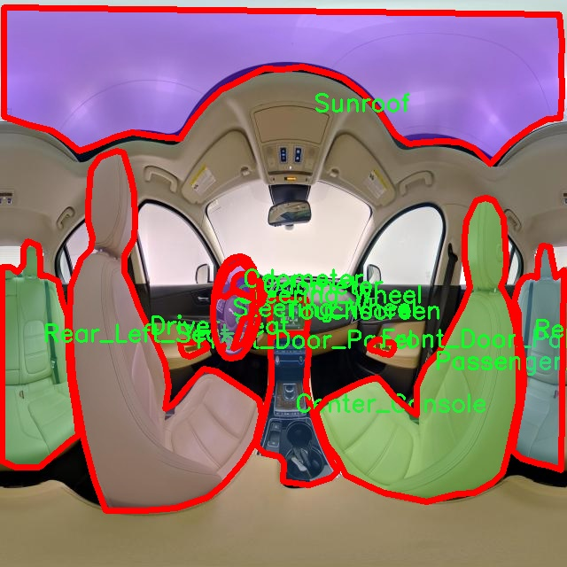
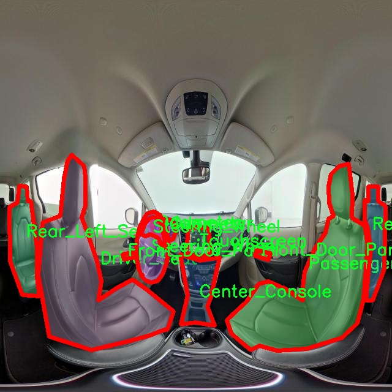

# 汽车内饰图像分割系统： yolov8-seg-C2f-REPVGGOREPA

### 1.研究背景与意义

[参考博客](https://gitee.com/YOLOv8_YOLOv11_Segmentation_Studio/projects)

[博客来源](https://kdocs.cn/l/cszuIiCKVNis)

研究背景与意义

随着汽车工业的快速发展，汽车内饰的设计与功能日益受到重视。汽车内饰不仅仅是车辆的装饰，更是提升用户体验、增强安全性和便利性的关键因素。现代消费者对汽车内饰的期望已经超越了传统的舒适性与美观性，越来越多的智能化、个性化元素被融入到汽车设计中。因此，如何高效、准确地对汽车内饰进行分析与处理，成为了汽车设计、制造和后期维护中的重要课题。

在这一背景下，图像分割技术作为计算机视觉领域的重要研究方向，逐渐被应用于汽车内饰的分析中。图像分割旨在将图像分解为多个具有相似特征的区域，以便于后续的处理和分析。特别是在汽车内饰的场景中，图像分割可以帮助设计师和工程师更好地理解内饰的布局、功能分布以及材料使用等，从而优化设计方案，提高产品质量。

YOLO（You Only Look Once）系列模型因其在目标检测和分割任务中的高效性和准确性，已成为研究者们的热门选择。YOLOv8作为该系列的最新版本，进一步提升了模型的性能，尤其是在处理复杂场景和细粒度目标时表现出色。然而，传统的YOLOv8模型在汽车内饰图像分割任务中仍然面临一些挑战，例如对小目标的识别能力不足、背景干扰影响分割精度等。因此，基于YOLOv8的改进版本，专门针对汽车内饰图像分割进行优化，具有重要的研究意义。

本研究所使用的数据集“interiorpano_seg_train”包含1200张高质量的汽车内饰图像，涵盖了10个不同的类别，包括中心控制台、驾驶座、前门面板、里程表、乘客座、后左座、后右座、方向盘、天窗和触摸屏等。这些类别的多样性为模型的训练提供了丰富的样本，有助于提高分割的准确性和鲁棒性。此外，数据集中不同部件的细致标注，能够为模型的学习提供明确的目标，促进其在实际应用中的表现。

通过对YOLOv8模型的改进，结合上述数据集的特征，本研究旨在构建一个高效的汽车内饰图像分割系统。该系统不仅能够实现对汽车内饰各个部件的精确分割，还能为后续的智能化应用提供基础支持，如自动化检测、质量评估和用户体验优化等。这将为汽车制造商、设计师和消费者带来显著的价值，推动汽车内饰设计的智能化和个性化进程。

综上所述，基于改进YOLOv8的汽车内饰图像分割系统的研究，不仅具有重要的理论价值，也在实际应用中展现出广阔的前景。通过提升汽车内饰的分析能力，能够更好地满足市场需求，推动汽车行业的技术进步与创新发展。

### 2.图片演示


注意：本项目提供完整的训练源码数据集和训练教程,由于此博客编辑较早,暂不提供权重文件（best.pt）,需要按照6.训练教程进行训练后实现上图效果。

### 3.视频演示

[3.1 视频演示](https://www.bilibili.com/video/BV1hzUAY9EFM/)

### 4.数据集信息

##### 4.1 数据集类别数＆类别名

nc: 10
names: ['Center_Console', 'Driver_Seat', 'Front_Door_Panel', 'Odometer', 'Passenger_Seat', 'Rear_Left_Seat', 'Rear_Right_Seat', 'Steering_Wheel', 'Sunroof', 'Touchscreen']


##### 4.2 数据集信息简介

数据集信息展示

在本研究中，我们采用了名为“interiorpano_seg_train”的数据集，以训练和改进YOLOv8-seg模型，旨在实现汽车内饰图像的高效分割。该数据集专注于汽车内饰的多个关键组成部分，涵盖了十个不同的类别，每个类别都代表了汽车内饰中不可或缺的元素。这些类别包括：中央控制台（Center_Console）、驾驶座（Driver_Seat）、前门面板（Front_Door_Panel）、里程表（Odometer）、乘客座椅（Passenger_Seat）、后左座椅（Rear_Left_Seat）、后右座椅（Rear_Right_Seat）、方向盘（Steering_Wheel）、天窗（Sunroof）以及触摸屏（Touchscreen）。通过对这些类别的精确分割，我们的目标是提升汽车内饰图像的处理能力，为后续的智能驾驶、车载系统开发以及用户体验优化提供更为可靠的数据支持。

“interiorpano_seg_train”数据集的构建过程充分考虑了汽车内饰的多样性与复杂性，确保每个类别的样本在视觉上具有代表性。这一数据集不仅包含了多种车型的内饰图像，还涵盖了不同的拍摄角度和光照条件，从而增强了模型的泛化能力。每个类别的样本均经过精细标注，确保在训练过程中，YOLOv8-seg模型能够准确识别和分割出各个内饰组件。这种高质量的标注不仅提升了模型的学习效率，也为后续的评估和验证提供了坚实的基础。

在数据集的使用过程中，我们将重点关注模型在不同类别上的表现，特别是那些在实际应用中对用户体验影响较大的组件，如中央控制台和触摸屏。这些组件通常是用户与车辆交互的主要界面，因此其分割精度直接关系到后续智能系统的响应速度和准确性。此外，驾驶座和乘客座椅的分割也同样重要，因为它们涉及到安全性和舒适性的评估。

为了确保模型的训练效果，我们将采用多种数据增强技术，以增加数据集的多样性和丰富性。这些技术包括旋转、缩放、翻转、颜色调整等，旨在模拟不同的使用场景和环境条件，从而提升模型的鲁棒性和适应性。通过这种方式，我们希望能够使YOLOv8-seg模型在处理汽车内饰图像时，能够更加准确地识别和分割出各个组件，进而提升整体的图像理解能力。

总之，“interiorpano_seg_train”数据集为本研究提供了丰富的训练素材，涵盖了汽车内饰的多个关键部分。通过对这些数据的深入分析和处理，我们期望能够显著提升YOLOv8-seg模型在汽车内饰图像分割任务中的表现，为未来的智能驾驶和车载系统开发奠定坚实的基础。







### 5.项目依赖环境部署教程（零基础手把手教学）

[5.1 环境部署教程链接（零基础手把手教学）](https://www.bilibili.com/video/BV1jG4Ve4E9t/?vd_source=bc9aec86d164b67a7004b996143742dc)


[5.2 安装Python虚拟环境创建和依赖库安装视频教程链接（零基础手把手教学）](https://www.bilibili.com/video/BV1nA4VeYEze/?vd_source=bc9aec86d164b67a7004b996143742dc)

### 6.手把手YOLOV8-seg训练视频教程（零基础手把手教学）

[6.1 手把手YOLOV8-seg训练视频教程（零基础小白有手就能学会）](https://www.bilibili.com/video/BV1cA4VeYETe/?vd_source=bc9aec86d164b67a7004b996143742dc)


按照上面的训练视频教程链接加载项目提供的数据集，运行train.py即可开始训练



     Epoch   gpu_mem       box       obj       cls    labels  img_size
     1/200     0G   0.01576   0.01955  0.007536        22      1280: 100%|██████████| 849/849 [14:42<00:00,  1.04s/it]
               Class     Images     Labels          P          R     mAP@.5 mAP@.5:.95: 100%|██████████| 213/213 [01:14<00:00,  2.87it/s]
                 all       3395      17314      0.994      0.957      0.0957      0.0843

     Epoch   gpu_mem       box       obj       cls    labels  img_size
     2/200     0G   0.01578   0.01923  0.007006        22      1280: 100%|██████████| 849/849 [14:44<00:00,  1.04s/it]
               Class     Images     Labels          P          R     mAP@.5 mAP@.5:.95: 100%|██████████| 213/213 [01:12<00:00,  2.95it/s]
                 all       3395      17314      0.996      0.956      0.0957      0.0845

     Epoch   gpu_mem       box       obj       cls    labels  img_size
     3/200     0G   0.01561    0.0191  0.006895        27      1280: 100%|██████████| 849/849 [10:56<00:00,  1.29it/s]
               Class     Images     Labels          P          R     mAP@.5 mAP@.5:.95: 100%|███████   | 187/213 [00:52<00:00,  4.04it/s]
                 all       3395      17314      0.996      0.957      0.0957      0.0845


### 7.50+种全套YOLOV8-seg创新点加载调参实验视频教程（一键加载写好的改进模型的配置文件）

[7.1 50+种全套YOLOV8-seg创新点加载调参实验视频教程（一键加载写好的改进模型的配置文件）](https://www.bilibili.com/video/BV1Hw4VePEXv/?vd_source=bc9aec86d164b67a7004b996143742dc)

### YOLOV8-seg算法简介

原始YOLOv8-seg算法原理

YOLOv8-seg算法是YOLO系列的最新版本，继承了前几代算法的优点，并在此基础上进行了多项创新与优化。作为一种单阶段目标检测与分割算法，YOLOv8-seg不仅在检测精度上有显著提升，同时在处理速度上也表现出色，能够满足实时应用的需求。该算法的设计理念是将目标检测与实例分割任务整合在一个统一的框架中，从而实现高效的目标识别与分割。

YOLOv8-seg的整体结构可以分为四个主要部分：输入处理、Backbone骨干网络、Neck特征融合网络和Head检测模块。输入处理模块负责对输入图像进行预处理，包括图像的尺寸调整、颜色空间转换以及数据增强等操作。数据增强策略包括马赛克增强、混合增强、空间扰动和颜色扰动等，这些手段有效地提高了模型的鲁棒性，使其在面对不同场景和光照条件时依然能够保持较高的检测性能。

在Backbone部分，YOLOv8-seg采用了C2f模块替代了传统的C3模块。C2f模块通过引入更多的分支，增强了梯度的流动性，使得网络在特征提取时能够获得更丰富的信息。这种设计不仅保留了YOLO系列的轻量级特性，还在不同尺度的模型中调整了通道数，以适应不同大小目标的检测需求。YOLOv8-seg的主干网络沿用了DarkNet的结构，但在细节上进行了优化，特别是在特征图的处理上，通过SPPF模块对输出特征图进行多尺度池化，确保了特征信息的充分利用。

Neck部分则采用了特征金字塔网络（FPN）与路径聚合网络（PAN）的结合，以实现多尺度特征的融合。通过这种双塔结构，YOLOv8-seg能够有效地整合来自不同层次的特征信息，从而增强对小目标和大目标的检测能力。特征金字塔网络通过上采样和下采样的方式，确保了语义信息和定位信息的有效传递，而路径聚合网络则进一步提升了特征的表达能力，使得网络在处理复杂场景时表现得更加出色。

在Head检测模块中，YOLOv8-seg采用了解耦头的结构，将分类和回归任务分开处理。这种解耦设计使得每个任务能够专注于自身的目标，从而提高了检测的精度和效率。具体而言，解耦头由两条并行的分支组成，一条用于提取类别特征，另一条用于提取位置特征。通过这种方式，YOLOv8-seg能够更好地处理复杂场景下的目标定位和分类问题，减少了因任务耦合而导致的错误。

YOLOv8-seg在标签分配策略上也进行了创新，采用了动态标签分配策略，解决了正负样本匹配的多尺度分配问题。与之前版本依赖于固定锚框的方式不同，YOLOv8-seg通过TOOD策略实现了更加灵活的标签分配。该策略仅依赖于目标框和目标分数，避免了因数据集不足而导致的候选框聚类不准确的问题。在损失函数的设计上，YOLOv8-seg引入了Varifocal Loss和CIoU Loss等多种损失函数，以实现对分类和回归的有效优化。这些损失函数通过对正负样本进行加权处理，使得网络能够更加关注高质量的样本，从而提升整体的检测性能。

总的来说，YOLOv8-seg算法在多个方面进行了优化与创新，使其在目标检测与实例分割任务中展现出优异的性能。通过高效的特征提取、灵活的标签分配以及精确的损失函数设计，YOLOv8-seg不仅能够实现高精度的目标检测，还能够有效地进行实例分割，满足多种应用场景的需求。这一系列的改进使得YOLOv8-seg在实际应用中具备了更强的竞争力，能够为各类智能视觉系统提供强有力的支持。


### 9.系统功能展示（检测对象为举例，实际内容以本项目数据集为准）

图9.1.系统支持检测结果表格显示

  图9.2.系统支持置信度和IOU阈值手动调节

  图9.3.系统支持自定义加载权重文件best.pt(需要你通过步骤5中训练获得)

  图9.4.系统支持摄像头实时识别

  图9.5.系统支持图片识别

  图9.6.系统支持视频识别

  图9.7.系统支持识别结果文件自动保存

  图9.8.系统支持Excel导出检测结果数据


### 10.50+种全套YOLOV8-seg创新点原理讲解（非科班也可以轻松写刊发刊，V11版本正在科研待更新）

#### 10.1 由于篇幅限制，每个创新点的具体原理讲解就不一一展开，具体见下列网址中的创新点对应子项目的技术原理博客网址【Blog】：


[10.1 50+种全套YOLOV8-seg创新点原理讲解链接](https://gitee.com/qunmasj/good)

#### 10.2 部分改进模块原理讲解(完整的改进原理见上图和技术博客链接)【如果此小节的图加载失败可以通过CSDN或者Github搜索该博客的标题访问原始博客，原始博客图片显示正常】
### CBAM空间注意力机制
近年来，随着深度学习研究方向的火热，注意力机制也被广泛地应用在图像识别、语音识别和自然语言处理等领域，注意力机制在深度学习任务中发挥着举足轻重的作用。注意力机制借鉴于人类的视觉系统，例如，人眼在看到一幅画面时，会倾向于关注画面中的重要信息，而忽略其他可见的信息。深度学习中的注意力机制和人类视觉的注意力机制相似，通过扫描全局数据，从大量数据中选择出需要重点关注的、对当前任务更为重要的信息，然后对这部分信息分配更多的注意力资源，从这些信息中获取更多所需要的细节信息，而抑制其他无用的信息。而在深度学习中，则具体表现为给感兴趣的区域更高的权重，经过网络的学习和调整，得到最优的权重分配，形成网络模型的注意力，使网络拥有更强的学习能力，加快网络的收敛速度。
注意力机制通常可分为软注意力机制和硬注意力机制[4-5]。软注意力机制在选择信息时，不是从输入的信息中只选择1个，而会用到所有输入信息，只是各个信息对应的权重分配不同，然后输入网络模型进行计算;硬注意力机制则是从输入的信息中随机选取一个或者选择概率最高的信息，但是这一步骤通常是不可微的，导致硬注意力机制更难训练。因此，软注意力机制应用更为广泛，按照原理可将软注意力机制划分为:通道注意力机制（channel attention)、空间注意力机制(spatial attention）和混合域注意力机制(mixed attention)。
通道注意力机制的本质建立各个特征通道之间的重要程度，对感兴趣的通道进行重点关注，弱化不感兴趣的通道的作用;空间注意力的本质则是建模了整个空间信息的重要程度，然后对空间内感兴趣的区域进行重点关注，弱化其余非感兴趣区域的作用;混合注意力同时运用了通道注意力和空间注意力，两部分先后进行或并行，形成对通道特征和空间特征同时关注的注意力模型。

卷积层注意力模块(Convolutional Block Attention Module，CBAM）是比较常用的混合注意力模块，其先后集中了通道注意力模块和空间注意力模块，网络中加入该模块能有效提高网络性能，减少网络模型的计算量，模块结构如图所示。输入特征图首先经过分支的通道注意力模块，然后和主干的原特征图融合，得到具有通道注意力的特征图，接着经过分支的空间注意力模块，在和主干的特征图融合后，得到同时具有通道特征注意力和空间特征注意力的特征图。CBAM模块不改变输入特征图的大小，因此该模块是一个“即插即用”的模块，可以插入网络的任何位置。

通道注意力模块的结构示意图如图所示，通道注意力模块分支并行地对输入的特征图进行最大池化操作和平均池化操作，然后利用多层感知机对结果进行变换，得到应用于两个通道的变换结果，最后经过sigmoid激活函数将变换结果融合，得到具有通道注意力的通道特征图。

空间注意力模块示意图如图所示，将通道注意力模块输出的特征图作为该模块的输入特征图，首先对输入特征图进行基于通道的最大池化操作和平均池化操作，将两部分得到的结果拼接起来，然后通过卷积得到降为Ⅰ通道的特征图，最后通过sigmoid激活函数生成具有空间注意力的特征图。


### 11.项目核心源码讲解（再也不用担心看不懂代码逻辑）

#### 11.1 ultralytics\utils\callbacks\comet.py

以下是对给定代码的核心部分进行提炼和详细注释的结果：

```python
# 导入必要的库
from ultralytics.utils import LOGGER, RANK, SETTINGS, TESTS_RUNNING, ops
import os
from pathlib import Path

# 检查Comet ML库是否可用
try:
    assert not TESTS_RUNNING  # 确保不在测试模式下
    assert SETTINGS['comet'] is True  # 确保集成已启用
    import comet_ml
    assert hasattr(comet_ml, '__version__')  # 确保导入的是包而非目录
except (ImportError, AssertionError):
    comet_ml = None  # 如果导入失败，设置为None

# 获取环境变量设置的函数
def _get_comet_mode():
    """返回环境变量中设置的Comet模式，默认为'online'。"""
    return os.getenv('COMET_MODE', 'online')

def _get_comet_model_name():
    """返回环境变量中设置的模型名称，默认为'YOLOv8'。"""
    return os.getenv('COMET_MODEL_NAME', 'YOLOv8')

def _get_eval_batch_logging_interval():
    """获取评估批次日志记录间隔，默认为1。"""
    return int(os.getenv('COMET_EVAL_BATCH_LOGGING_INTERVAL', 1))

def _get_max_image_predictions_to_log():
    """获取最大图像预测日志记录数量。"""
    return int(os.getenv('COMET_MAX_IMAGE_PREDICTIONS', 100))

# 创建实验的函数
def _create_experiment(args):
    """确保在分布式训练中只在一个进程中创建实验对象。"""
    if RANK not in (-1, 0):  # 仅在主进程中创建实验
        return
    try:
        comet_mode = _get_comet_mode()
        project_name = os.getenv('COMET_PROJECT_NAME', args.project)
        experiment = comet_ml.OfflineExperiment(project_name=project_name) if comet_mode == 'offline' else comet_ml.Experiment(project_name=project_name)
        experiment.log_parameters(vars(args))  # 记录参数
    except Exception as e:
        LOGGER.warning(f'WARNING ⚠️ Comet安装但未正确初始化，未记录此运行。{e}')

# 日志记录混淆矩阵的函数
def _log_confusion_matrix(experiment, trainer, curr_step, curr_epoch):
    """将混淆矩阵记录到Comet实验中。"""
    conf_mat = trainer.validator.confusion_matrix.matrix  # 获取混淆矩阵
    names = list(trainer.data['names'].values()) + ['background']  # 获取类别名称
    experiment.log_confusion_matrix(
        matrix=conf_mat,
        labels=names,
        max_categories=len(names),
        epoch=curr_epoch,
        step=curr_step,
    )

# 日志记录图像的函数
def _log_images(experiment, image_paths, curr_step, annotations=None):
    """将图像记录到实验中，带有可选注释。"""
    if annotations:
        for image_path, annotation in zip(image_paths, annotations):
            experiment.log_image(image_path, name=image_path.stem, step=curr_step, annotations=annotation)
    else:
        for image_path in image_paths:
            experiment.log_image(image_path, name=image_path.stem, step=curr_step)

# 训练结束时的操作
def on_train_end(trainer):
    """训练结束时执行的操作。"""
    experiment = comet_ml.get_global_experiment()  # 获取全局实验
    if not experiment:
        return

    curr_epoch = trainer.epoch + 1  # 当前轮次
    curr_step = curr_epoch * (len(trainer.train_loader.dataset) // trainer.batch_size)  # 当前步骤

    # 记录模型和混淆矩阵
    _log_confusion_matrix(experiment, trainer, curr_step, curr_epoch)
    experiment.end()  # 结束实验

# 定义回调函数
callbacks = {
    'on_train_end': on_train_end
} if comet_ml else {}
```

### 代码核心部分说明：
1. **导入和初始化**：导入必要的库并检查Comet ML的可用性。
2. **环境变量获取**：通过一系列函数获取环境变量设置，确保实验配置的灵活性。
3. **实验创建**：确保在分布式训练中只在主进程中创建实验对象，并记录参数。
4. **日志记录功能**：包括记录混淆矩阵和图像的功能，便于后续分析和可视化。
5. **训练结束处理**：在训练结束时执行必要的清理和日志记录操作。

这些核心部分是实现YOLOv8与Comet ML集成的基础，便于监控和分析模型训练过程中的性能。

这个文件是一个用于集成Comet.ml的回调模块，主要用于在训练YOLO模型时记录和可视化各种实验数据。文件首先导入了一些必要的模块和库，包括Ultralytics的工具和Comet.ml库。接着，它会检查是否在测试环境中运行，并确认Comet集成是否启用。

文件中定义了一些函数，用于获取环境变量设置的参数，例如Comet的运行模式、模型名称、评估批次日志记录间隔、最大图像预测数量等。这些参数可以通过环境变量进行配置，以便用户根据需求调整记录的行为。

接下来，文件定义了一些用于处理和格式化数据的函数，包括将YOLOv8训练中缩放的边界框转换回原始图像形状的函数，以及格式化真实标签和预测结果的函数。这些函数确保在记录时，数据能够以正确的格式传递给Comet.ml。

在训练过程中，文件提供了一些回调函数，例如在预训练开始时创建或恢复Comet实验、在每个训练周期结束时记录指标和保存图像、在每个适应周期结束时记录模型资产等。这些回调函数会在训练的不同阶段被调用，以便将相关信息记录到Comet实验中。

此外，文件还定义了一些辅助函数来记录混淆矩阵、图像和模型信息，以便于后续分析和可视化。最后，文件将这些回调函数汇总到一个字典中，以便在训练过程中调用。

总体来说，这个文件的主要功能是将YOLO模型训练过程中的各种信息记录到Comet.ml中，以便用户能够更好地监控和分析模型的训练效果。

#### 11.2 ultralytics\models\yolo\classify\predict.py

以下是经过简化和注释的核心代码部分：

```python
import torch
from ultralytics.engine.predictor import BasePredictor
from ultralytics.engine.results import Results
from ultralytics.utils import DEFAULT_CFG, ops

class ClassificationPredictor(BasePredictor):
    """
    该类扩展了 BasePredictor 类，用于基于分类模型进行预测。
    可以使用 Torchvision 分类模型，例如：model='resnet18'。
    """

    def __init__(self, cfg=DEFAULT_CFG, overrides=None, _callbacks=None):
        """初始化 ClassificationPredictor，将任务设置为 'classify'。"""
        super().__init__(cfg, overrides, _callbacks)  # 调用父类构造函数
        self.args.task = 'classify'  # 设置任务类型为分类

    def preprocess(self, img):
        """将输入图像转换为模型兼容的数据类型。"""
        # 如果输入不是 Tensor，则将其转换为 Tensor
        if not isinstance(img, torch.Tensor):
            img = torch.stack([self.transforms(im) for im in img], dim=0)  # 应用转换并堆叠成一个批次
        # 将图像移动到模型所在的设备上（CPU或GPU）
        img = (img if isinstance(img, torch.Tensor) else torch.from_numpy(img)).to(self.model.device)
        # 根据模型的精度要求，将图像转换为半精度（fp16）或单精度（fp32）
        return img.half() if self.model.fp16 else img.float()  # uint8 转换为 fp16/32

    def postprocess(self, preds, img, orig_imgs):
        """对预测结果进行后处理，返回 Results 对象。"""
        # 如果原始图像不是列表，则将其转换为 NumPy 数组
        if not isinstance(orig_imgs, list):
            orig_imgs = ops.convert_torch2numpy_batch(orig_imgs)

        results = []  # 存储结果的列表
        for i, pred in enumerate(preds):  # 遍历每个预测结果
            orig_img = orig_imgs[i]  # 获取对应的原始图像
            img_path = self.batch[0][i]  # 获取图像路径
            # 创建 Results 对象并添加到结果列表中
            results.append(Results(orig_img, path=img_path, names=self.model.names, probs=pred))
        return results  # 返回处理后的结果列表
```

### 代码注释说明：
1. **导入模块**：导入了必要的库和类，包括 PyTorch 和 Ultralytics 的相关模块。
2. **ClassificationPredictor 类**：该类继承自 `BasePredictor`，用于处理分类任务。
3. **构造函数**：初始化时设置任务类型为分类，并调用父类的构造函数。
4. **预处理方法**：将输入图像转换为模型可以接受的格式，包括类型转换和设备迁移。
5. **后处理方法**：将模型的预测结果与原始图像进行匹配，并返回一个包含结果的列表。

这个程序文件是Ultralytics YOLO框架中的一个分类预测器实现，文件名为`predict.py`。它主要用于基于分类模型进行图像分类的预测。该文件首先导入了必要的库，包括PyTorch和Ultralytics的相关模块。

在文件中定义了一个名为`ClassificationPredictor`的类，它继承自`BasePredictor`类。这个类的主要功能是扩展基础预测器，以便处理分类任务。类的文档字符串中提到，可以将Torchvision的分类模型传递给`model`参数，例如使用`model='resnet18'`。

在类的构造函数`__init__`中，调用了父类的构造函数，并将任务类型设置为'分类'。这意味着该预测器专门用于处理分类任务。

`preprocess`方法用于对输入图像进行预处理，以转换为模型所需的数据类型。该方法首先检查输入是否为PyTorch张量，如果不是，则将其转换为张量。接着，将图像数据移动到模型所在的设备上（例如GPU），并根据模型的精度要求将数据类型转换为半精度（fp16）或单精度（fp32）。

`postprocess`方法则用于对模型的预测结果进行后处理，以返回`Results`对象。该方法首先检查原始图像是否为列表，如果不是，则将其转换为NumPy数组。然后，它遍历每个预测结果，并将原始图像、图像路径、模型名称和预测概率封装到`Results`对象中，最终返回这些结果。

整体来看，这个文件实现了一个用于图像分类的预测器，包含了图像的预处理和后处理功能，使得用户能够方便地进行分类任务的预测。

#### 11.3 model.py

以下是经过简化和注释的核心代码部分：

```python
# -*- coding: utf-8 -*-
import cv2  # 导入OpenCV库，用于处理图像和视频
import torch  # 导入PyTorch库，用于深度学习
from ultralytics import YOLO  # 从ultralytics库中导入YOLO类，用于加载YOLO模型
from ultralytics.utils.torch_utils import select_device  # 导入选择设备的工具函数
from chinese_name_list import Chinese_name  # 导入中文名称字典

# 根据是否有可用的GPU选择设备
device = "cuda:0" if torch.cuda.is_available() else "cpu"

# 初始化参数字典
ini_params = {
    'device': device,  # 设备类型
    'conf': 0.3,  # 物体置信度阈值
    'iou': 0.05,  # IOU阈值用于非极大值抑制
    'classes': None,  # 类别过滤器
    'verbose': False  # 是否详细输出
}

class Web_Detector:  # 定义Web_Detector类
    def __init__(self, params=None):  # 构造函数
        self.model = None  # 初始化模型为None
        self.names = list(Chinese_name.values())  # 获取所有类别的中文名称
        self.params = params if params else ini_params  # 设置参数

    def load_model(self, model_path):  # 加载模型的方法
        self.device = select_device(self.params['device'])  # 选择设备
        self.model = YOLO(model_path)  # 加载YOLO模型
        # 将类别名称转换为中文
        self.names = [Chinese_name[v] if v in Chinese_name else v for v in self.model.names.values()]

        # 预热模型
        self.model(torch.zeros(1, 3, *[640] * 2).to(self.device).type_as(next(self.model.model.parameters())))

    def predict(self, img):  # 预测方法
        results = self.model(img, **ini_params)  # 使用模型进行预测
        return results  # 返回预测结果

    def postprocess(self, pred):  # 后处理方法
        results = []  # 初始化结果列表
        for res in pred[0].boxes:  # 遍历预测结果中的每个边界框
            class_id = int(res.cls.cpu())  # 获取类别ID
            bbox = res.xyxy.cpu().squeeze().tolist()  # 获取边界框坐标
            bbox = [int(coord) for coord in bbox]  # 转换为整数

            result = {
                "class_name": self.names[class_id],  # 类别名称
                "bbox": bbox,  # 边界框
                "score": res.conf.cpu().squeeze().item(),  # 置信度
                "class_id": class_id  # 类别ID
            }
            results.append(result)  # 添加结果到列表

        return results  # 返回处理后的结果列表
```

### 代码说明：
1. **导入库**：导入必要的库，包括OpenCV、PyTorch和YOLO模型。
2. **设备选择**：根据是否有可用的GPU选择设备（`cuda`或`cpu`）。
3. **初始化参数**：设置YOLO模型的初始参数，包括置信度阈值和IOU阈值。
4. **Web_Detector类**：
   - **构造函数**：初始化模型和类别名称。
   - **load_model方法**：加载YOLO模型并进行预热，以确保模型可以正常工作。
   - **predict方法**：对输入图像进行预测，返回预测结果。
   - **postprocess方法**：处理预测结果，提取类别名称、边界框和置信度，并返回整理后的结果列表。

这个程序文件 `model.py` 是一个用于目标检测的实现，主要依赖于 OpenCV 和 YOLO（You Only Look Once）模型。首先，程序导入了必要的库，包括 OpenCV 用于图像处理，PyTorch 用于深度学习模型的加载和推理，以及 QtFusion 和 ultralytics 库中的相关类和函数。

程序首先定义了一个设备变量 `device`，根据是否有可用的 GPU 来选择使用 CUDA 还是 CPU。接着，定义了一些初始化参数，包括物体置信度阈值、IOU 阈值、类别过滤器等，这些参数用于控制检测过程的行为。

`count_classes` 函数用于统计检测结果中每个类别的数量。它接收检测信息和类别名称列表，创建一个字典来记录每个类别的计数，然后遍历检测信息并更新计数，最后返回按类别名称顺序排列的计数列表。

接下来，定义了一个名为 `Web_Detector` 的类，继承自 `Detector` 抽象基类。这个类的构造函数初始化了一些属性，包括模型、图像和类别名称等。如果没有提供参数，则使用预定义的初始化参数。

`load_model` 方法用于加载 YOLO 模型。根据模型路径的前缀判断任务类型（分割或检测），然后使用 YOLO 类加载模型。接着，将模型的类别名称转换为中文，并进行一次预热以提高后续推理的速度。

`preprocess` 方法用于对输入图像进行预处理，当前实现只是简单地保存原始图像并返回。`predict` 方法接收图像并使用加载的模型进行预测，返回预测结果。

`postprocess` 方法用于处理模型的预测结果。它遍历预测结果中的每个边界框，提取类别 ID、边界框坐标、置信度等信息，并将这些信息组织成字典形式，最终返回包含所有检测结果的列表。

最后，`set_param` 方法允许更新检测器的参数，方便在运行时调整检测行为。整体来看，这个程序文件提供了一个完整的目标检测流程，从模型加载到图像预处理、预测和后处理，适用于基于 YOLO 的目标检测任务。

#### 11.4 ultralytics\trackers\utils\gmc.py

以下是经过简化和注释的核心代码部分：

```python
import cv2
import numpy as np
from ultralytics.utils import LOGGER

class GMC:
    """
    通用运动补偿（GMC）类，用于视频帧中的跟踪和目标检测。
    支持多种跟踪算法，包括ORB、SIFT、ECC和稀疏光流。
    """

    def __init__(self, method='sparseOptFlow', downscale=2):
        """初始化GMC对象，设置跟踪方法和缩放因子。"""
        self.method = method
        self.downscale = max(1, int(downscale))

        # 根据选择的方法初始化特征检测器和匹配器
        if self.method == 'orb':
            self.detector = cv2.FastFeatureDetector_create(20)
            self.extractor = cv2.ORB_create()
            self.matcher = cv2.BFMatcher(cv2.NORM_HAMMING)
        elif self.method == 'sift':
            self.detector = cv2.SIFT_create()
            self.extractor = cv2.SIFT_create()
            self.matcher = cv2.BFMatcher(cv2.NORM_L2)
        elif self.method == 'ecc':
            self.warp_mode = cv2.MOTION_EUCLIDEAN
            self.criteria = (cv2.TERM_CRITERIA_EPS | cv2.TERM_CRITERIA_COUNT, 5000, 1e-6)
        elif self.method == 'sparseOptFlow':
            self.feature_params = dict(maxCorners=1000, qualityLevel=0.01, minDistance=1, blockSize=3)
        elif self.method in ['none', 'None', None]:
            self.method = None
        else:
            raise ValueError(f'未知的GMC方法: {method}')

        # 初始化存储变量
        self.prevFrame = None
        self.prevKeyPoints = None
        self.prevDescriptors = None
        self.initializedFirstFrame = False

    def apply(self, raw_frame, detections=None):
        """根据选择的方法对原始帧应用对象检测。"""
        if self.method in ['orb', 'sift']:
            return self.applyFeatures(raw_frame, detections)
        elif self.method == 'ecc':
            return self.applyEcc(raw_frame, detections)
        elif self.method == 'sparseOptFlow':
            return self.applySparseOptFlow(raw_frame, detections)
        else:
            return np.eye(2, 3)  # 返回单位矩阵

    def applyEcc(self, raw_frame, detections=None):
        """应用ECC算法进行帧对齐。"""
        height, width, _ = raw_frame.shape
        frame = cv2.cvtColor(raw_frame, cv2.COLOR_BGR2GRAY)
        H = np.eye(2, 3, dtype=np.float32)

        # 图像下采样
        if self.downscale > 1.0:
            frame = cv2.resize(frame, (width // self.downscale, height // self.downscale))

        # 处理第一帧
        if not self.initializedFirstFrame:
            self.prevFrame = frame.copy()
            self.initializedFirstFrame = True
            return H

        # 运行ECC算法，获取变换矩阵H
        try:
            (cc, H) = cv2.findTransformECC(self.prevFrame, frame, H, self.warp_mode, self.criteria)
        except Exception as e:
            LOGGER.warning(f'变换失败，使用单位矩阵: {e}')

        return H

    def applyFeatures(self, raw_frame, detections=None):
        """应用特征检测方法（如ORB或SIFT）。"""
        height, width, _ = raw_frame.shape
        frame = cv2.cvtColor(raw_frame, cv2.COLOR_BGR2GRAY)
        H = np.eye(2, 3)

        # 图像下采样
        if self.downscale > 1.0:
            frame = cv2.resize(frame, (width // self.downscale, height // self.downscale))

        # 检测关键点
        keypoints = self.detector.detect(frame)

        # 处理第一帧
        if not self.initializedFirstFrame:
            self.prevFrame = frame.copy()
            self.prevKeyPoints = keypoints
            self.initializedFirstFrame = True
            return H

        # 匹配描述符
        keypoints, descriptors = self.extractor.compute(frame, keypoints)
        knnMatches = self.matcher.knnMatch(self.prevDescriptors, descriptors, 2)

        # 过滤匹配
        goodMatches = []
        for m, n in knnMatches:
            if m.distance < 0.9 * n.distance:
                goodMatches.append(m)

        # 计算变换矩阵H
        if len(goodMatches) > 4:
            prevPoints = np.array([self.prevKeyPoints[m.queryIdx].pt for m in goodMatches])
            currPoints = np.array([keypoints[m.trainIdx].pt for m in goodMatches])
            H, _ = cv2.estimateAffinePartial2D(prevPoints, currPoints, cv2.RANSAC)

        # 更新前一帧数据
        self.prevFrame = frame.copy()
        self.prevKeyPoints = keypoints
        self.prevDescriptors = descriptors

        return H

    def applySparseOptFlow(self, raw_frame, detections=None):
        """应用稀疏光流方法进行帧对齐。"""
        height, width, _ = raw_frame.shape
        frame = cv2.cvtColor(raw_frame, cv2.COLOR_BGR2GRAY)
        H = np.eye(2, 3)

        # 图像下采样
        if self.downscale > 1.0:
            frame = cv2.resize(frame, (width // self.downscale, height // self.downscale))

        # 检测关键点
        keypoints = cv2.goodFeaturesToTrack(frame, mask=None, **self.feature_params)

        # 处理第一帧
        if not self.initializedFirstFrame:
            self.prevFrame = frame.copy()
            self.prevKeyPoints = keypoints
            self.initializedFirstFrame = True
            return H

        # 计算光流
        matchedKeypoints, status, _ = cv2.calcOpticalFlowPyrLK(self.prevFrame, frame, self.prevKeyPoints, None)

        # 过滤有效匹配
        prevPoints = []
        currPoints = []
        for i in range(len(status)):
            if status[i]:
                prevPoints.append(self.prevKeyPoints[i])
                currPoints.append(matchedKeypoints[i])

        # 计算变换矩阵H
        if len(prevPoints) > 4:
            H, _ = cv2.estimateAffinePartial2D(np.array(prevPoints), np.array(currPoints), cv2.RANSAC)

        # 更新前一帧数据
        self.prevFrame = frame.copy()
        self.prevKeyPoints = keypoints

        return H
```

### 代码注释说明：
1. **类 GMC**：实现了通用运动补偿，支持多种跟踪算法。
2. **初始化方法**：根据指定的跟踪方法初始化特征检测器和匹配器，并设置缩放因子。
3. **apply 方法**：根据选择的跟踪方法处理原始帧。
4. **applyEcc 方法**：实现了ECC算法，进行帧对齐，处理第一帧并返回变换矩阵。
5. **applyFeatures 方法**：实现了特征检测（如ORB或SIFT），并计算关键点的匹配和变换矩阵。
6. **applySparseOptFlow 方法**：实现了稀疏光流方法，计算光流并返回变换矩阵。

这个程序文件定义了一个名为 `GMC` 的类，主要用于视频帧中的目标跟踪和检测。它实现了多种跟踪算法，包括 ORB、SIFT、ECC 和稀疏光流，并支持对帧进行下采样以提高计算效率。

在类的初始化方法 `__init__` 中，用户可以指定所需的跟踪方法和下采样因子。根据选择的跟踪方法，程序会创建相应的特征检测器、描述符提取器和匹配器。例如，如果选择了 ORB 方法，则使用 OpenCV 的 ORB 创建器；如果选择了 SIFT 方法，则使用 SIFT 创建器；而对于 ECC 方法，则设置了相关的迭代次数和终止条件。初始化时还会设置一些用于存储前一帧、关键点和描述符的变量，并标记是否已处理第一帧。

`apply` 方法是类的主要接口，根据选择的跟踪方法调用相应的处理函数。它会根据当前帧和可选的检测结果，应用所选的跟踪算法并返回变换矩阵。

对于不同的跟踪方法，程序实现了多个辅助方法：
- `applyEcc` 方法使用了扩展的互相关（ECC）算法来处理当前帧。它首先将帧转换为灰度图像，并在必要时进行下采样。对于第一帧，它会初始化相关数据；之后，它会使用 `cv2.findTransformECC` 函数计算当前帧与前一帧之间的变换矩阵。
- `applyFeatures` 方法使用特征点检测和描述符匹配来处理当前帧。它会找到关键点并计算描述符，然后与前一帧的描述符进行匹配，筛选出有效的匹配点，并计算出刚性变换矩阵。
- `applySparseOptFlow` 方法使用稀疏光流法来跟踪关键点。它会检测当前帧中的关键点，并计算它们在前一帧中的对应点，最终同样计算出变换矩阵。

每个方法都考虑了下采样的情况，以便在处理较大图像时提高效率。类中的日志记录器 `LOGGER` 用于在发生错误时输出警告信息，例如在匹配点不足时。

总的来说，这个 `GMC` 类提供了一种灵活的方式来处理视频中的目标跟踪，支持多种算法并能根据需要调整处理的复杂度。

#### 11.5 ultralytics\trackers\utils\__init__.py

以下是代码的核心部分，并附上详细的中文注释：

```python
# Ultralytics YOLO 🚀, AGPL-3.0 license

# 这是Ultralytics YOLO的开源代码，遵循AGPL-3.0许可证

# YOLO（You Only Look Once）是一种实时目标检测算法
# 该算法通过将目标检测问题转化为回归问题，能够快速且准确地识别图像中的物体

# 主要步骤包括：
# 1. 加载模型
# 2. 处理输入图像
# 3. 进行目标检测
# 4. 输出检测结果

# 下面是YOLO模型的核心功能示例

def load_model(model_path):
    """
    加载YOLO模型
    :param model_path: 模型文件的路径
    :return: 加载的模型
    """
    # 这里通常会使用深度学习框架（如PyTorch）加载模型
    model = ...  # 具体加载代码
    return model

def detect_objects(model, image):
    """
    使用YOLO模型检测图像中的物体
    :param model: 加载的YOLO模型
    :param image: 输入图像
    :return: 检测到的物体及其位置
    """
    # 处理输入图像，调整大小、归一化等
    processed_image = ...  # 具体处理代码
    
    # 使用模型进行预测
    results = model(processed_image)
    
    # 解析结果，提取物体类别和位置
    detected_objects = ...  # 具体解析代码
    return detected_objects

# 示例使用
if __name__ == "__main__":
    model_path = "path/to/yolo/model"
    image_path = "path/to/input/image"
    
    # 加载模型
    model = load_model(model_path)
    
    # 读取输入图像
    image = ...  # 读取图像代码
    
    # 检测物体
    detected_objects = detect_objects(model, image)
    
    # 输出检测结果
    print(detected_objects)
```

### 注释说明：
1. **加载模型**：定义了一个函数来加载YOLO模型，通常需要指定模型文件的路径。
2. **检测物体**：定义了一个函数来使用加载的模型对输入图像进行目标检测，处理图像并返回检测结果。
3. **示例使用**：在主程序中加载模型、读取图像并调用检测函数，最后输出检测结果。

以上是YOLO目标检测的核心代码结构和功能注释。

这个文件是Ultralytics YOLO项目的一部分，文件名为`__init__.py`，它通常用于标识一个目录为Python包。文件开头的注释`# Ultralytics YOLO 🚀, AGPL-3.0 license`表明这个项目是与Ultralytics YOLO相关的，并且使用AGPL-3.0许可证。这意味着该代码是开源的，用户可以自由使用、修改和分发，但在分发修改后的版本时，必须遵循相同的许可证条款。

在Python中，`__init__.py`文件的存在使得Python解释器能够将包含该文件的目录视为一个包，从而可以导入该目录下的模块和子模块。虽然在这个文件中没有具体的代码实现，但它的存在通常用于初始化包的命名空间，可能还会包含一些导入语句，以便在导入包时自动加载特定的模块或功能。

总体来说，这个文件的主要作用是为Ultralytics YOLO的跟踪器模块提供一个包的结构，确保在使用时能够方便地导入和使用相关的功能。

### 12.系统整体结构（节选）

### 整体功能和构架概括

该项目是一个基于Ultralytics YOLO框架的目标检测和分类系统，旨在提供高效的模型训练、预测和跟踪功能。整体架构由多个模块组成，每个模块负责特定的功能，以便于维护和扩展。

1. **回调功能**：通过`comet.py`文件集成Comet.ml，用于记录和可视化训练过程中的各种实验数据，帮助用户监控模型的性能。
2. **分类预测**：`predict.py`文件实现了图像分类的预测功能，支持使用不同的分类模型进行图像处理。
3. **模型管理**：`model.py`文件提供了目标检测的核心功能，包括模型的加载、图像预处理、预测和后处理，支持YOLO模型的应用。
4. **目标跟踪**：`gmc.py`文件实现了多种目标跟踪算法，支持在视频帧中对目标进行跟踪，提供灵活的跟踪选项。
5. **包结构**：`__init__.py`文件用于将跟踪器模块组织为一个Python包，便于导入和使用。

### 文件功能整理表

| 文件路径                                      | 功能描述                                                                                  |
|-----------------------------------------------|-------------------------------------------------------------------------------------------|
| `ultralytics/utils/callbacks/comet.py`      | 集成Comet.ml，记录和可视化训练过程中的实验数据，提供回调函数以监控模型性能。             |
| `ultralytics/models/yolo/classify/predict.py` | 实现图像分类的预测功能，支持使用不同的分类模型进行图像处理，包含预处理和后处理方法。   |
| `model.py`                                    | 提供目标检测的核心功能，包括模型加载、图像预处理、预测和后处理，支持YOLO模型应用。    |
| `ultralytics/trackers/utils/gmc.py`         | 实现多种目标跟踪算法（如ORB、SIFT、ECC和稀疏光流），支持视频帧中的目标跟踪。           |
| `ultralytics/trackers/utils/__init__.py`    | 将跟踪器模块组织为一个Python包，便于导入和使用相关功能。                                 |

这个结构和功能划分使得系统具有良好的模块化特性，便于后续的扩展和维护。

### 13.图片、视频、摄像头图像分割Demo(去除WebUI)代码

在这个博客小节中，我们将讨论如何在不使用WebUI的情况下，实现图像分割模型的使用。本项目代码已经优化整合，方便用户将分割功能嵌入自己的项目中。
核心功能包括图片、视频、摄像头图像的分割，ROI区域的轮廓提取、类别分类、周长计算、面积计算、圆度计算以及颜色提取等。
这些功能提供了良好的二次开发基础。

### 核心代码解读

以下是主要代码片段，我们会为每一块代码进行详细的批注解释：

```python
import random
import cv2
import numpy as np
from PIL import ImageFont, ImageDraw, Image
from hashlib import md5
from model import Web_Detector
from chinese_name_list import Label_list

# 根据名称生成颜色
def generate_color_based_on_name(name):
    ......

# 计算多边形面积
def calculate_polygon_area(points):
    return cv2.contourArea(points.astype(np.float32))

...
# 绘制中文标签
def draw_with_chinese(image, text, position, font_size=20, color=(255, 0, 0)):
    image_pil = Image.fromarray(cv2.cvtColor(image, cv2.COLOR_BGR2RGB))
    draw = ImageDraw.Draw(image_pil)
    font = ImageFont.truetype("simsun.ttc", font_size, encoding="unic")
    draw.text(position, text, font=font, fill=color)
    return cv2.cvtColor(np.array(image_pil), cv2.COLOR_RGB2BGR)

# 动态调整参数
def adjust_parameter(image_size, base_size=1000):
    max_size = max(image_size)
    return max_size / base_size

# 绘制检测结果
def draw_detections(image, info, alpha=0.2):
    name, bbox, conf, cls_id, mask = info['class_name'], info['bbox'], info['score'], info['class_id'], info['mask']
    adjust_param = adjust_parameter(image.shape[:2])
    spacing = int(20 * adjust_param)

    if mask is None:
        x1, y1, x2, y2 = bbox
        aim_frame_area = (x2 - x1) * (y2 - y1)
        cv2.rectangle(image, (x1, y1), (x2, y2), color=(0, 0, 255), thickness=int(3 * adjust_param))
        image = draw_with_chinese(image, name, (x1, y1 - int(30 * adjust_param)), font_size=int(35 * adjust_param))
        y_offset = int(50 * adjust_param)  # 类别名称上方绘制，其下方留出空间
    else:
        mask_points = np.concatenate(mask)
        aim_frame_area = calculate_polygon_area(mask_points)
        mask_color = generate_color_based_on_name(name)
        try:
            overlay = image.copy()
            cv2.fillPoly(overlay, [mask_points.astype(np.int32)], mask_color)
            image = cv2.addWeighted(overlay, 0.3, image, 0.7, 0)
            cv2.drawContours(image, [mask_points.astype(np.int32)], -1, (0, 0, 255), thickness=int(8 * adjust_param))

            # 计算面积、周长、圆度
            area = cv2.contourArea(mask_points.astype(np.int32))
            perimeter = cv2.arcLength(mask_points.astype(np.int32), True)
            ......

            # 计算色彩
            mask = np.zeros(image.shape[:2], dtype=np.uint8)
            cv2.drawContours(mask, [mask_points.astype(np.int32)], -1, 255, -1)
            color_points = cv2.findNonZero(mask)
            ......

            # 绘制类别名称
            x, y = np.min(mask_points, axis=0).astype(int)
            image = draw_with_chinese(image, name, (x, y - int(30 * adjust_param)), font_size=int(35 * adjust_param))
            y_offset = int(50 * adjust_param)

            # 绘制面积、周长、圆度和色彩值
            metrics = [("Area", area), ("Perimeter", perimeter), ("Circularity", circularity), ("Color", color_str)]
            for idx, (metric_name, metric_value) in enumerate(metrics):
                ......

    return image, aim_frame_area

# 处理每帧图像
def process_frame(model, image):
    pre_img = model.preprocess(image)
    pred = model.predict(pre_img)
    det = pred[0] if det is not None and len(det)
    if det:
        det_info = model.postprocess(pred)
        for info in det_info:
            image, _ = draw_detections(image, info)
    return image

if __name__ == "__main__":
    cls_name = Label_list
    model = Web_Detector()
    model.load_model("./weights/yolov8s-seg.pt")

    # 摄像头实时处理
    cap = cv2.VideoCapture(0)
    while cap.isOpened():
        ret, frame = cap.read()
        if not ret:
            break
        ......

    # 图片处理
    image_path = './icon/OIP.jpg'
    image = cv2.imread(image_path)
    if image is not None:
        processed_image = process_frame(model, image)
        ......

    # 视频处理
    video_path = ''  # 输入视频的路径
    cap = cv2.VideoCapture(video_path)
    while cap.isOpened():
        ret, frame = cap.read()
        ......
```


### 14.完整训练+Web前端界面+50+种创新点源码、数据集获取


# [下载链接：https://mbd.pub/o/bread/Z5WblpZr](https://mbd.pub/o/bread/Z5WblpZr)